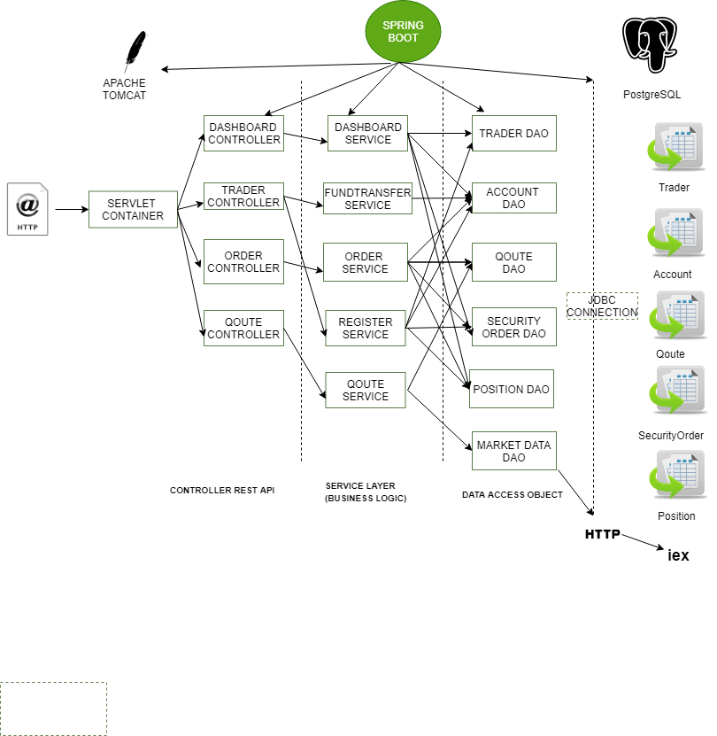



<h1 id="introduction">TRADING REST API</h1>
<h2> Introduction</h2>

This REST API is a micro-service in order to obtain stock prices and help track a users positions. This micro-service was built using SpringBoot and PostgreSQL database  in order to store information and can be used by front-end developer, mobile developer, and traders. It makes use of an external REST API from the IEX servers [https://iextrading.com/]. The service utilizes the IEX API in order to pull up to date stock information which it will then store locally within the PSQL database.

## Quick Start 

To run this micro-service the user is expected to have access to the following:

-   Java virtual machine to run the application
-   PostgreSQL
-   Docker (or similar) to hold the database
-   Clone of the application
-   IEX cloud API key

<h2 id="usage">Set-up</h2>

  Create an account on [https://iexcloud.i](https://iexcloud.io/) and get your public key token.

<code> 
export IEX_PUB_TOKEN='your_iex_pub_key'
export PSQL_PASSWORD="your password" 
export PSQL_USER=" psql user" 
export PSQL_HOST="psql host"
$ source ~/.bash_profile
 </code>

 <h3>Usage</h3>

 A startup script called StartScript.sh is included in the project to start the project.

#start docker

<code>
systemctl status docker || systemctl start docker || sleep 5
</code>

#create docker volume to persist db data

<code>
docker ps | grep "pgdata" || docker volume create pgdata || sleeep 1
</code>

#stop existing jrvs-psql container

<code>
docker ps | grep jrvs-psql && docker stop $(docker ps | grep jrvs-psql | awk '{print $1}')
</code>

#start docker

<code>
docker run --rm --name jrvs-psql -e POSTGRES_PASSWORD=$PSQL_PASSWORD -d -v pgdata:/var/lib/postgresql/data -p 5432:5432 $PSQL_USER
sleep 5
</code>

#setup database

<code>
psql -h $PSQL_HOST -U $PSQL_USER -f ./sql_ddl/init_db.sql
psql -h $PSQL_HOST -U $PSQL_USER -d jrvstrading -f ./sql_ddl/schema.sql
</code>

#run springboot app

<code>
/usr/bin/java -jar ./target/trading-1.0-SNAPSHOT.jar
</code>

 #To run the application locally 

<code>http://localhost:8080/swagger-ui.html</code>
<h3>Usage</h3>
<h3> Swagger</h3>

Swagger is an open-source software famework that helps developers design, build, document, and consume REST APIs. By reading the API structure, it automatically builds an interactive API documentation. Swagger creates an user interface that allows easy interaction with the REST API.

<h3>QouteController</h3>

This controller is responsible for information retrieval of all the stocks available to be traded. The information on asking and biding price and size are retrieved from the IEX cloud and then cached in the quote table in the PSQL database. Following are the endpoints :

- GET  `/quote/dailyList`: list all securities that are available to trading in this trading system
-   GET  `/quote/iex/ticker/{ticker}`: show the current information available on the IEX cloud for a ticker
-   POST  `/quote/tickerId/{tickerId}`: add a new ticker to the quote table so that this security can be used for trades
-   PUT  `/quote/`: manually update the information for one security in the quote table
-   PUT  `/quote/iexMarketData`: update all quotes from IEX which is an external market data source 

<h3>OrderController</h3>

This controller is used to create a market order. This has just one end-point.

- POST `/marketOrder`This order consists of AccountID, ticker and size for buying/selling. A positive size indicates buying and negative is for selling. A check on account balance is done to make sure user is eligible to buy and check on stock holdings is done to ensure he/she could sell it. 

<h3> TraderController</h3>

 
This controller is used to manage trader accounts and add/substract balance from them.

- DELETE /traderId/{traderId} To delete a particular trader using ID.
- POST /firstname/{firstname}/lastname/{lastname}/dob/{dob}/country/{country}/email/{email} TO create a trader using his/her information.
- PUT /deposit/accountId/{accountId}/amount/{amount} To deposit an particular amount to an given account.
- PUT /withdraw/accountId/{accountId}/amount/{amount} To withdraw an particular amount to an given account.

<h3>AppController</h3>
The app controller can the used to make sure that the app is up and running.

-   GET  `/health`: make sure SpringBoot app is up and running.

<h3>Architecture</h3>

**Controller**  The controller layer handles HTTP request to the REST API. It maps the request to the correct method call in the service layer.

**Service**  The service layers is responsible for all business logic. It validates user input and throws an exception, if not valid. Otherwise, it will process the input, call the corresponding methods in the dao layer.

**Dao**  The dao layer takes input from the service layer and makes the correct call to the database or HTTP request to the IEX cloud. It will process the HTTP response/result set into Java objects and return those to the service layer.

**Spring boot**  This project is implemented using spring boot. The core of the spring framework is the spring IoC (inversion of control) container. This container will create all objects, wire them together, configure them, and manage their complete life cycle from creation till destruction. This application uses Apache Tomcat as its servlet container.

**PSQL**  The PostgreSQL database contains four tables and one view. The table "trader" stores first name, last name, email address, country, date of birth, and an autogenerated id for every trader. The table "account" stores the available fund, the id of the trader owning the account, and an autogenerated id for every account. The table "quote" contains ticker, ask price, ask size, bid price, bid size, and last price for every security that can be traded in this app. The table "security_order" stores the account id of the account used for the order, the status (fulfilled or canceled), the ticker of the traded security, the size of the order, the price of the order, and some notes.

**IEX cloud**  Our trading app uses the IEX cloud to get real-time information on the securities that can be traded. IEX cloud ([https://iexcloud.io/](https://iexcloud.io/)) is a REST API that provides access to US and Canadian stock data. 

<h3>Improvements</h3>

-   Auto-increament ids can not be re-used once they are deleted. it can be re-used in future implementation and can be benificial.
-   Auto-updation of dailylist can be implemented in future.
-   Trader can be allowed to have multiple accounts.
-   Once the market is closed, a trader can not trade in stocks. This can be improved by saving the quote just before the market closes and used that to allow trader to trade and immediately execute their request when the market re-opens.
-Short positions can be allowed.
> Written with [StackEdit](https://stackedit.io/).

> Written with [StackEdit](https://stackedit.io/).

> Written with [StackEdit](https://stackedit.io/).
